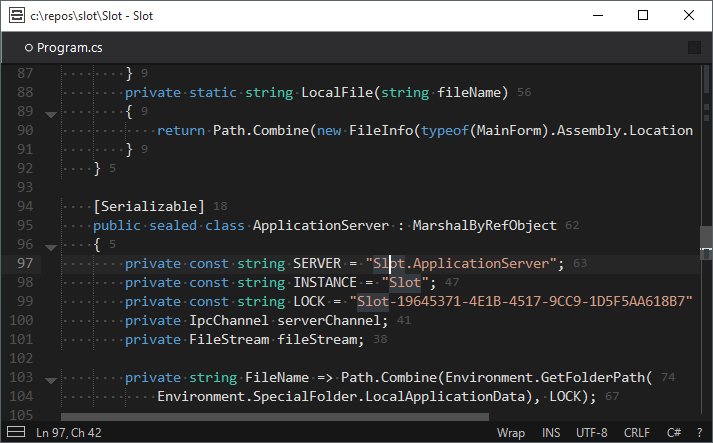

# What is Slot
Slot is a cross-platform command based text editor which main priorities are - minimalistic yet modern UI that reduces cognitive load while working, streamlined UX, integrated command line with quick access to all editor's functions, easy extensibility with new highlighting schemes, autocomplete and folding strategies, etc. At its core Slot is a completely safe managed application written in 100% C# with no API calls; the same Slot binaries can run under Windows (.NET or Mono), Linux and Mac OS (Mono). Slot uses an in-house developed text editing engine with lots of advanced features such as syntax highlighting, folding, multiple carets and selections, configurable word wrapping modes, soft and hard tabs, multi-level undo and redo, and much more. Slot was inspired by such editors as ViM, Atom, VSCode, and Zed.

Slot is meant to serve a single purpose - to be a text editor. Slot is not intended to work as an integrated environment, window manager, terminal emulator, etc. You can use Slot along with other tools of your choice. Slot's user interface is designed as distraction free and minimalistic - it means no split or floating windows, no tabs, no tool bars and menus. However, it doesn't mean that Slot lacks some of the essential features provided by other editors. For example, if you need a split view you can open the same buffer in a new window and use your operative system window manager to display two Slot windows side by side (which can be easily done in modern operative systems such as Windows 10 by dragging windows to the edges of a screen). Tabbed MDI interface is not supported, but you can still work with multiple files in Slot - either in different windows, or in the same window and switch between buffers by pressing `Ctrl+Tab` (which would display all opened buffers in a convinient order).

# Slot basics
Slot is a command based editor. It means that all Slot features are exposed as commands. You can even think about Slot as a terminal with a graphical text editor attached to it. For example, to open a file you should activate Slot command line (`F2` by default) and use the following command:

    f-o [path_to_the_file] | [encoding]

Commands in Slot can accept arguments (separated by `|`). Also arguments may be optional (such as `encoding` argument in the command above) and if you do not provide a value a default value is used (Slot will open all files in UTF-8 by default).

Using command line is easier and more convinient than it might appear at a first glance - Slot offers autocomplete and lists of standard argument values. For example, if you hit `Ctrl+O` (a default shortcut for opening files) an editor would silently execute an `f-o` command; however, as long as no arguments are supplied an autocomplete list would automatically popup, allowing you to choose a file to open.

An `f-o` in the example above is called a _command alias_. Most of frequently used commands (such as text editing commands) also have configurable shortcuts. Last but not least Slot offers a command palette (which you might know already from other modern editors) that allows you quickly search a required command by its description. By default command palette can be triggered by pressing `F1`. (By the way a command palette in Slot is yet another command with `?` alias).

Actually an easiest way to learn what Slot can do is to hit `F1` (or an icon with a question mark in a status bar) and browse a list of all available commands. Command palette displays both command alias (which can be used to invoke a command from command line) and a command shortcut.

# Files and workspaces
Slot, like many other editors, allows you to open both files and folders (workspaces). The way how Slot treats folders is somewhat different from other editors.

Every time you open a file, Slot remembers the parent folder of this file and sets it as a current directory. When you switch between opened files (or Slot windows) the current directory is switched as well. Slot doesn't feature a file explorer pane, however a regular open file command defaults to the current directory, e.g. if you execute `f-o` command, a list of files and folders in the current directory would popup by default. This treatment of files and folders is called _implicit workspaces_.

Slot also allows to create _explicit workspaces_. An explicit workspace is a folder that has a special `.slot` subfolder in it. The `.slot` subfolder can be used to store settings (that override standard settings) or build tasks. Slot looks for `.slot` folder both in the current files directory and in parent directories as well. For example, if you open a file `\parent\child\file.txt` with no explicit workspace configured, Slot would automatically set `\parent\child` as a current workspace. However, if you have configured workspace at a parent folder (e.g. you have created a folder `\parent\.slot`), Slot will set `\parent` as a current workspace.
